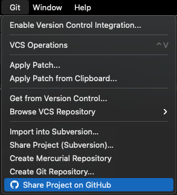

# 인텔리제이로 마크다운 시작하기

블로그를 시작하고 초심과 다르게 글 작성을 안 하고 있습니다. 좋은 자료와 공부한 내용을 블로그에 정리해서 올릴 생각은 매일매일 하고 있지만 꾸준하게 실행으로 옮기기에는 저의 의지로는 불가능한 것 같습니다. 지난 2020년, 1년 동안 계획한 많은 일을 나름 성실하게 수행하고 이뤄냈지만, 글로 남기지는 못했습니다. 2021년이 되고 작년을 뒤돌아봤지만 많은 부분들이 희미하게 기억날 뿐.. 그래서 올해에는 다양한 활동에 대한 내용을 글로 꾸준하게 기록해보기로 다시 한번 다짐했습니다.

새로운 마음으로 시작하기에 앞서 게시글 작성 방식을 바꿔보기로 했습니다. 기존에 티스토리에서 제공하는 에디터로 글을 작성했던 방식에서 마크다운(markdown) 형식으로 바꾸려고 합니다.

1. 개발 도구(IDE, Editor)를 이용해서 마크다운으로 글을 작성한다.
2. 작성한 글은 깃허브(github)를 통해서 관리한다.
3. 마크다운 형식으로 티스토리 블로그에 포스팅한다.

해당 방식으로 바꾸는 이유는 티스토리 에디터에 접속해서 글을 작성하고 포스팅하는 과정이 생각보다 귀찮고, 글 형식을 맞추는데 어느 정도의 노력이 필요합니다. 하지만 개발 도구를 통해서 작성하면 접근성이 용이하며 환경이 익숙하고, 마크다운의 간단한 문법으로 깔끔한 형식의 글을 작성할 수 있기 때문입니다.

저는 대부분의 개발 도구를 젯브레인(jetbrains)의 제품을 사용하고 있습니다. 그중에서 인텔리제이(IntelliJ IDEA)를 주로 사용하고 있기 때문에 인텔리제이를 이용해서 마크다운으로 글을 작성해보도록 하겠습니다.

- - -
### 1. IntelliJ IDEA 마크다운 생성하기

  
[Step. 01] IntelliJ IDEA를 실행 후 `New Project`를 클릭해 주세요.

- - -

  
[Step. 02] 프로젝트 템플릿 목록에서 `Web`을 선택해 주세요.

- - -

  
[Step. 03] `Project name`에 자신의 프로젝트 이름을 작성해주세요.
```
[파일명에서 사용하는 "하이픈(-), 언더바(_)" 차이점]
: 검색엔진에서 하이픈(-)은 각 단어로 인식합니다. 즉, 공백으로 처리 후 인식합니다.
  그리고 언더바(_)는 전체 문장을 한 단어로 인식합니다. 아래 예제를 참고해 주세요.
  (차이점이 궁금해서 찾아본 내용을 공유합니다.)

[Example]
1. "markdown-posts-repository" -> "markdown posts repository"
2. "markdown_posts_repository" -> "markdownpostsrepository"
```

- - -

  
[Step. 04] 프로젝트 도구 창에서 디렉토리 클릭 후 `Command+N(Alt+Insert)` 단축키로 `File`을 선택해 주세요.

- - -

  
[Step. 05] `READMD.md` 이름의 파일을 생성하고 좌측 에디터에 마크다운 문법을 작성하면 우측에 Preview 창으로 미리 보기가 가능합니다.  
(마크다운 파일의 확장자는 `.md`입니다.)

- - -

  
[Step. 06] `README.md` 파일 단위로 관리하거나 또는 디렉토리를 생성해서 계층 단위로 마크다운 파일과 이미지 파일을 관리할 수 있습니다.

- - -
### 2. GitHub에 올리기

  
[Step. 07] 상단 메뉴바에서 `Share Project on GitHub`을 클릭해 주세요.

- - -

  
[Step. 08] 깃허브에 저장할 `Repository name`과 `Description`을 입력 후 `Share` 버튼을 클릭하면 자신의 깃허브에 올릴 수 있습니다.

- - -

마크다운으로 작성해본 첫 번째 글입니다. 꾸준하게 글을 작성하면서 자유자재로 사용하는 걸 목표로 하고 있습니다.  
또한 현재까지는 직접 티스토리에 포스팅을 하고 있지만, 나중에는 [티스토리 Open API](https://tistory.github.io/document-tistory-apis/ )를 이용하여 포스팅을 도전해보도록 하겠습니다. 
